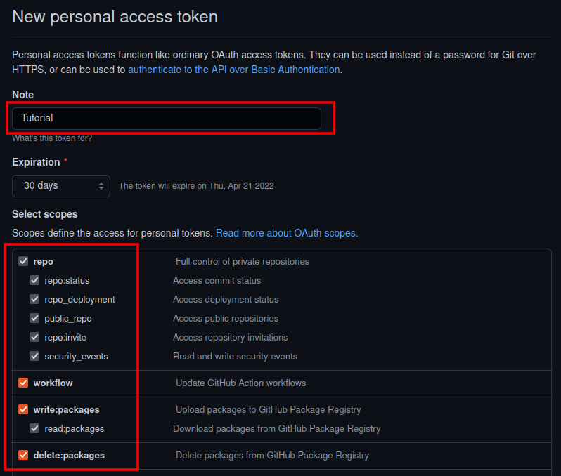

# Lab 3. Build an Image and Analyze in Mayhem

This lab will show you how to build a Docker image for a toy program, push it to a Docker registry, and then use Mayhem to analyze the toy program in the image.

## Login to the GitHub Container Registry

1. First, we need to setup Docker to enable pushing new images for a later step.

2. Navigate to https://github.com.

3. Click on your user account icon to reveal a drop down menu.

    

4. Click on settings in the drop down menu.

    

5. On the left side of the settings page, select "Developer Settings."

    

6. On the developer settings page, select "Personal Access Tokens".

    

7. Click create new token.

    

8. Enter a note for the token, and check the repo, workflow, write:packages, and delete:packages scopes.

    

9. Scroll to the bottom and click "Generate New Token".

    

10. Click the copy button to copy the token to your clipboard.

    

11. Back on the command-line, we'll use the `docker login` command to login to the GitHub container registry.

    ```
    docker login -u <Your GitHub Username> ghcr.io
    ```

    When prompted for a password, paste your personal access token (PAT) that you copied in the previous step. Note the token will not echo. After pasting, press enter.

    You should see something similar to the following:

    ```
    Password: 
    WARNING! Your password will be stored unencrypted in /home/nathan/.docker/config.json.
    Configure a credential helper to remove this warning. See
    https://docs.docker.com/engine/reference/commandline/login/#credentials-store

    Login Succeeded
    ```
    Make sure to save your personal access token in a file somewhere on your machine. (I keep mine in my [password store](https://www.passwordstore.org/)). You'll want to use it later!

## Build and Push the Docker Image

Now that you've logged in to the GitHub container registry, we can build and push a Docker image.

1. Clone the cansecwest22 repo and change into the fuzzme directory.

    ```
    git clone https://github.com/ForAllSecure/cansecwest22.git
    cd cansecwest22/fuzzme/
    ```

2. List the contents of the `fuzzme` directory.

    ```
    ls
    ```

    You should see the following:

    ```
    Dockerfile
    Mayhemfile
    fuzzme.c
    ```

3. Examine the Dockerfile.

    ```
    cat Dockerfile
    ```

    You'll see that the Dockerfile is split up into two stages: the build stage, and the package stage.

    ```Dockerfile
    # Build Stage:
    FROM --platform=linux/amd64 ubuntu:20.04 as builder

    ## Install build dependencies.
    RUN apt-get update && \
        DEBIAN_FRONTEND=noninteractive apt-get install -y gcc
    
    ## Add Source Code
    ADD fuzzme.c /
    
    ## Build Step
    RUN gcc -g fuzzme.c -o fuzzme

    # Package Stage
    FROM --platform=linux/amd64 ubuntu:20.04
    COPY --from=builder /fuzzme /
    ```

    The build stage is where we will actually setup our build environment and compile the code.

    The package stage copies the executable into our final image. Note that we could combine these into one stage, but our resulting docker image would be much larger. So the best practice here is to separate the build stage from the package stage.

4. Now, build the image using the `docker build` command.

   In the docker build command, we specify a tag name using `-t`. The tag tells docker the registry (`ghcr.io`), the name (`<Your GitHub Username>/fuzzme`, and the version (`latest`).

    ```
    docker build -t ghcr.io/<Your GitHub Username>/fuzzme:latest .
    ```

    In the docker build command, we specify a tag name using `-t`. The tag tells docker the registry (`ghcr.io`), the name (`<Your GitHub Username>/fuzzme`, and the version (`latest`) of the Docker image.

    The last argument `.` specifies the build context, which in this case is the current directory. This tells Docker what directory it has access to on the host during the build process.

5. Once the build completes. Push the image to the registry.

    ```
    docker push ghcr.io/<Your GitHub Username>/fuzzme:latest
    ```

6. Now, mark the package as public so Mayhem can see it:

    * Navigate to github.com/\<Your username\>

    * Click on "Packages".

        

    * In the packages tab, click on "fuzzme".

        

    * Now click "Package settings"

        

    * Under "Danger Zone" click "Change visibility"

        

    * In the Change package visibility dialog, set the visibility to public, type the name "fuzzme" to confirm, and click "I understand..."

        
        
**Note:** If you haven't already, be sure to link the package to the repository as described here: https://docs.github.com/en/packages/learn-github-packages/connecting-a-repository-to-a-package#connecting-a-repository-to-a-user-owned-package-on-github

## Start a Mayhem Run

Now that you've pushed your image to Mayhem, let's kick off a run.

1. Using your favorite text editor, modify the Mayhemfile. Replace <YOUR GITHUB USERNAME> with your GitHub username. Your Mayhemfile should look similar to this:

    ```yaml
    # Namespaced project name that the target belongs to
    project: nathanjackson/cansecwest

    # Target name (should be unique within the project)
    target: fuzzme

    # Base image to run the binary in.
    image: ghcr.io/nathanjackson/fuzzme:latest

    # List of commands used to test the target
    cmds:

        # Command used to start the target, "@@" is the input file
        # (when "@@" is omitted Mayhem defaults to stdin inputs)
        - cmd: /fuzzme @@
    ```

2. Now kick off the run!

    ```
    mayhem run .
    ```

    You should see output similar to the following:

    ```
    Run started: cansecwest/fuzzme/1
    Run URL: https://mayhem.forallsecure.com:443/nathanjackson/cansecwest/fuzzme/1
    cansecwest/fuzzme/1
    ```
