# Lab 1a: Your First Run

## Overview

This guide will show you how to get started with Mayhem using the web interface.

**Time to complete**: About 5 minutes

## Step 1. Create a Mayhem account

Create a new account by navigating to [mayhem.forallsecure.com](https://mayhem.forallsecure.com) and select sign in with GitHub:

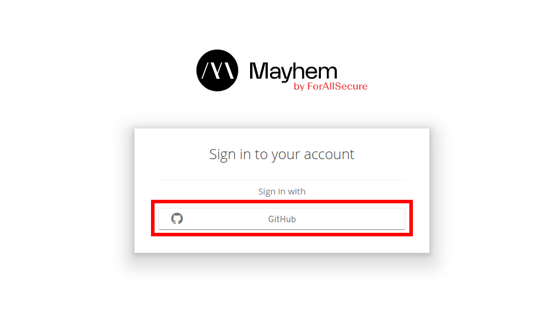

On the GitHub sign in page, enter your GitHub credentials or click Create an account:

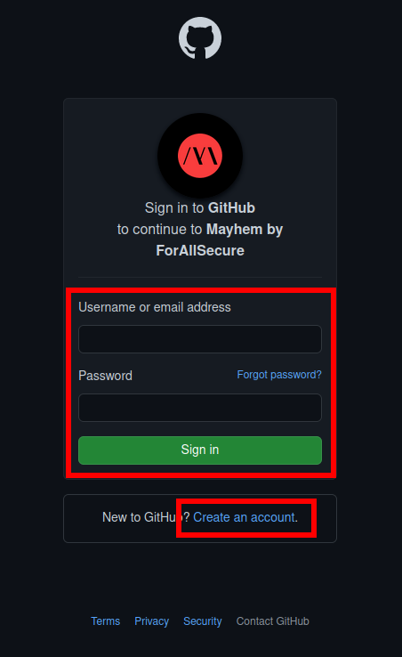

If you're creating a new GitHub account, follow the onscreen instructions.

In either case, if you're creating a new account or logging in with an existing account, you should eventually be prompted to authorize Mayhem. Click "Authorize ForAllSecure".

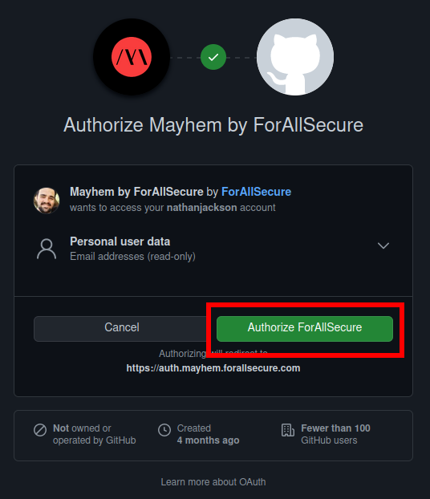

## Step 2. Create a new Run

Let's reproduce an exploit for [lighttpd](https://www.lighttpd.net/)! (version
1.4.15, to be specific).

   * Create a new project by clicking the "plus" icon at the top of the screen.
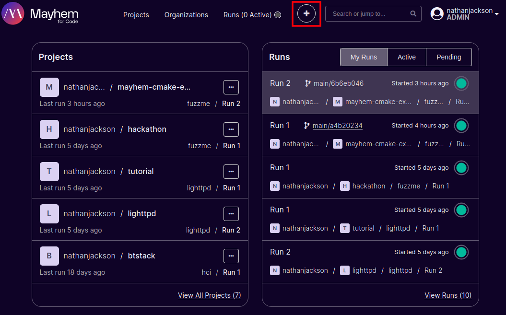
   * On the Choose Image page, enter the following: `forallsecure/lighttpd:vulnerable`.
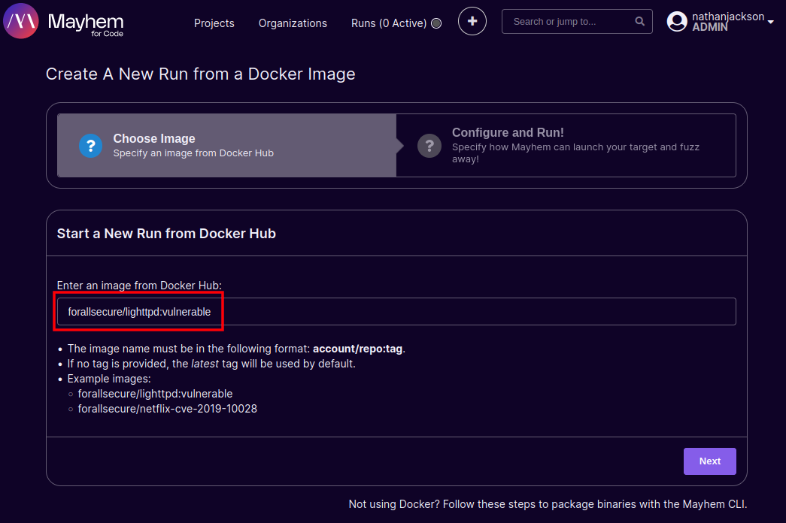
   * Once you've entered the image, click Next.
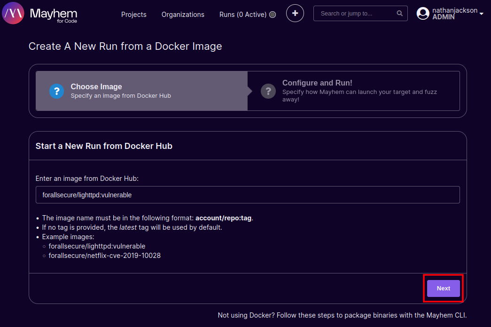


## Step 3. Configure Analysis

There are two tabs of analysis options: Basic and Advanced. We will be configuring three values:
   1. Under **Basic**, set the analysis to run 90 seconds.

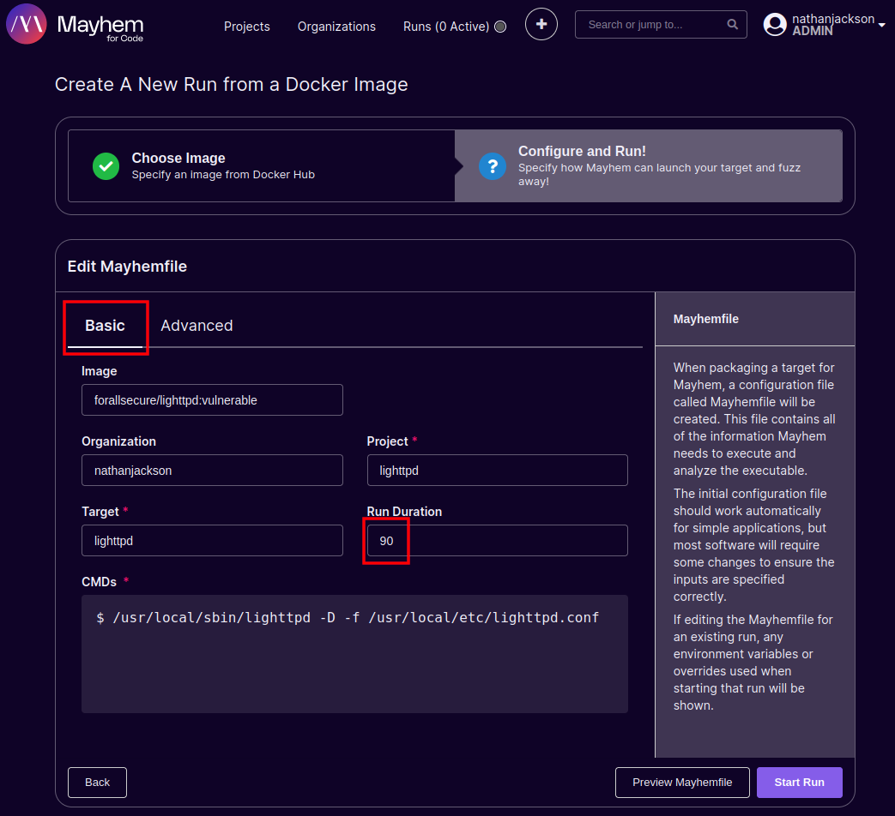

   2. Under **Advanced**, enable the **Advanced Triage** option and the **Code Coverage** task. 

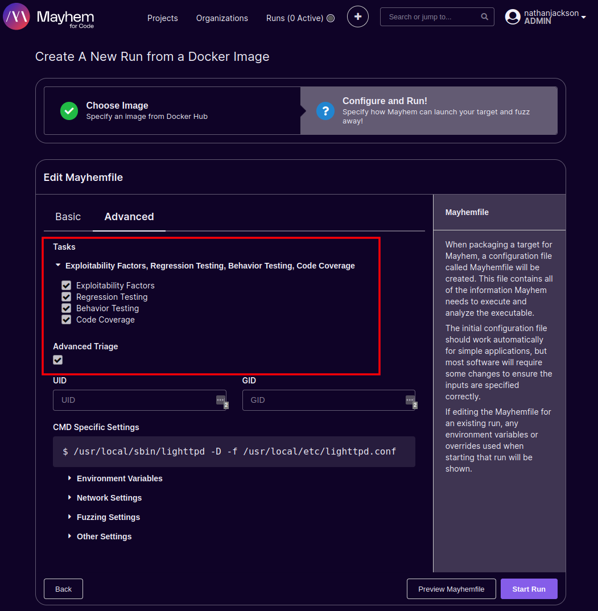

   
## Step 4. Click start run!

Click the start run button at the bottom of your screen to begin analysis!


The run will take a few minutes to complete, as analysis and post-analysis
processing need to finish. Once the run completes, the web page should look
similar to this:

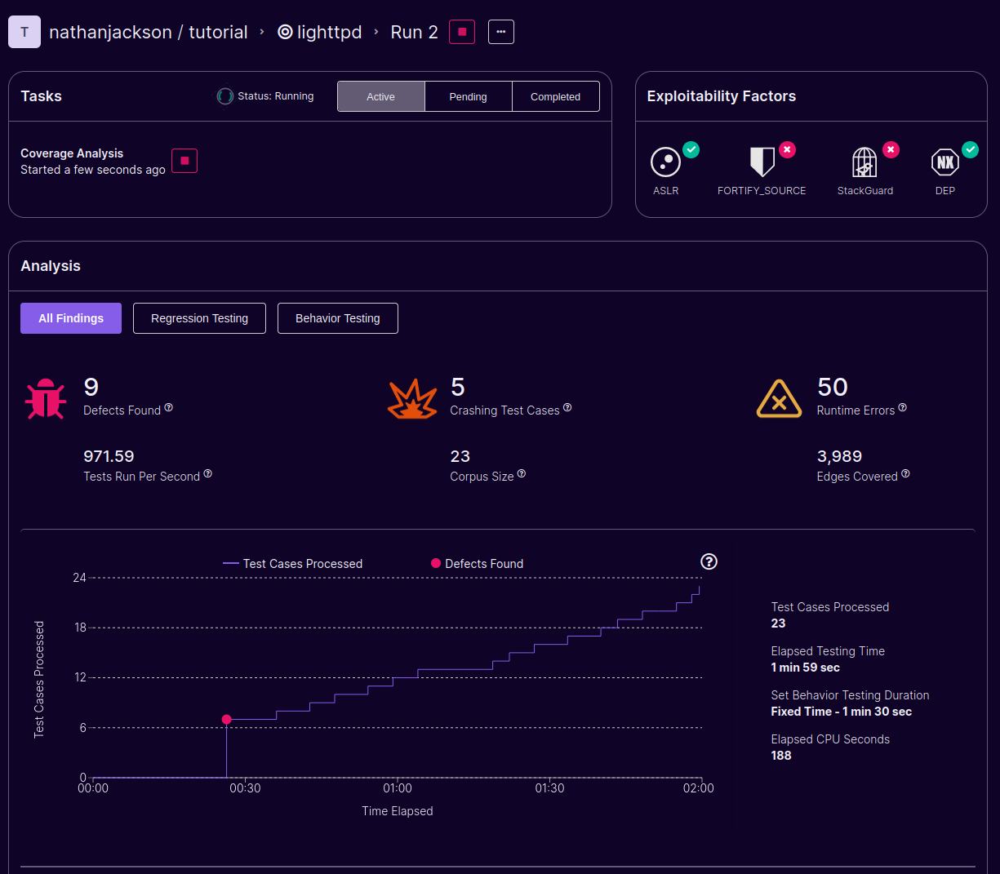

Congratulations!

You've just:
  * Learned how to start a new Mayhem analysis job using the web interface.
  * Found your first exploitable bug using Mayhem!
  
# Lab 1b: Run with the Mayhem CLI

## Overview

This guide will show you how to start a run using the Mayhem CLI.

**Time to complete**: About 5 minutes

## Step 1. Install the Mayhem CLI

Before using the Mayhem CLI, you need to install it. Fortunately, Mayhem provides instructions for you.

   * Click on "Download Mayhem CLI"

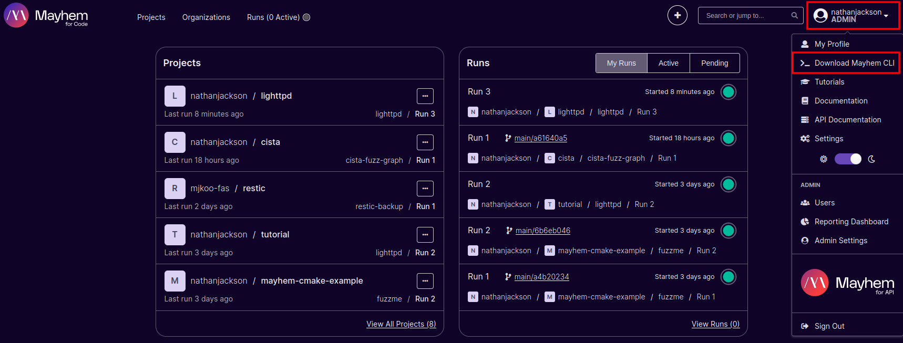

   * Follow the on-screen instructions.

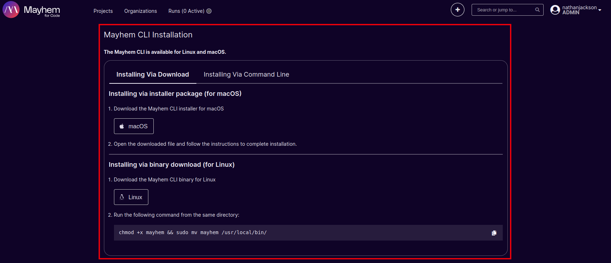

## Step 2. Log in to Mayhem with the CLI

The `mayhem` CLI authenticates to the Mayhem server using an API token. The API
token can be generated in your profile settings: located in the top-left under your username, then "Settings", then "API Tokens".

   * Open your settings.

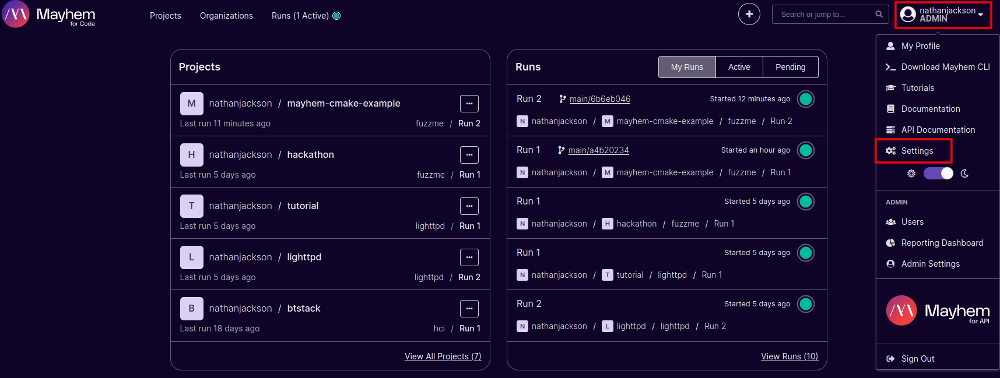

   * Select API Tokens.

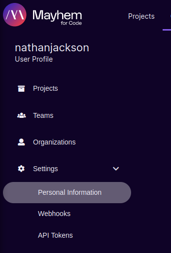

   * Click "Issue New Token".

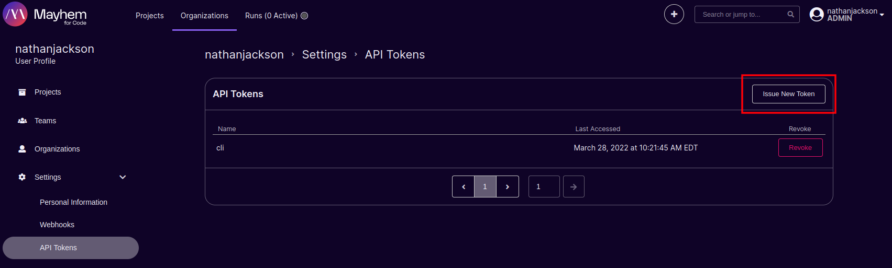

   * Enter a name for the Token.

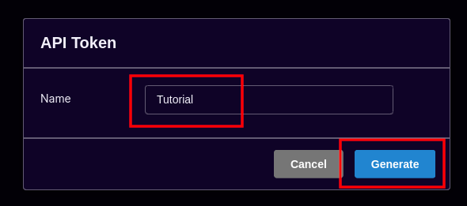

   * Copy the CLI Command.

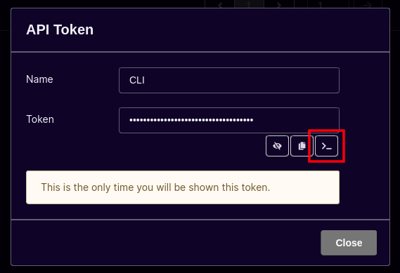

At this point the entire login command has been copied to your clipboard. Paste this into a terminal window.

The command should look similar to this:
```
mayhem login https://mayhem.forallsecure.com/ <YOUR API KEY>
```

## Step 3. Clone cansecwest22

Clone the cansecwest22 repo and change into the lighttpd directory.

```
git clone https://github.com/ForAllSecure/cansecwest22
cd cansecwest22/lighttpd/
```

## Step 4. Start the run with the Mayhem CLI.

For this tutorial, no changes to the Mayhemfile are neccesary. We're starting
the same run as in lab 1a, but this time with the CLI.

```
mayhem run .
```

You should see output that looks similar to this:
```
WARNING: corpus is not a file or directory, skipping
Run started: tutorial/lighttpd/2
Run URL: https://training.forallsecure.com:443/nathan/tutorial/lighttpd/2
tutorial/lighttpd/2
```

Note the warning regarding the corpus directory is normal for this tutorial.

Navigate to the Web interface for this run by clicking on the "Run URL" from
the output in the VM's shell.

Like lab 1a, the run may take a few minutes to complete, as analysis and
post-analysis processing need to finish. Once the run completes, the web page
should look similar to this:


Congratulations!

You've just:
  * Learned how to start a new Mayhem analysis job using the CLI.
  * Learned how to find a run in the UI after starting it with the CLI.

<walkthrough-conclusion-trophy></walkthrough-conclusion-trophy>

