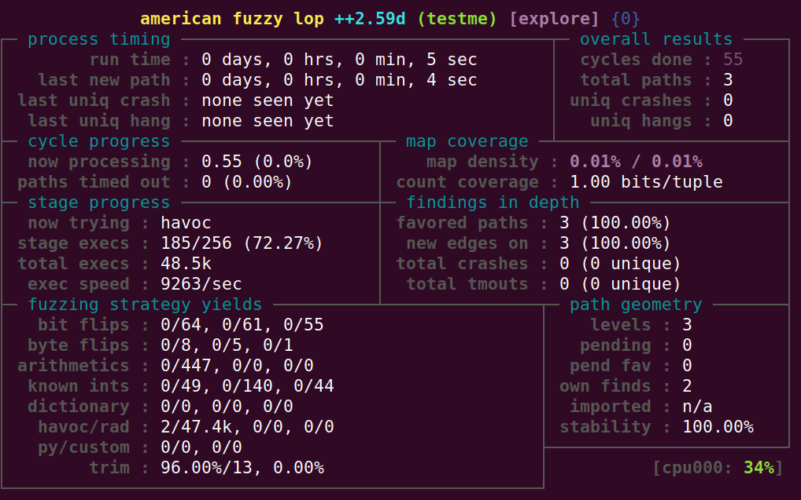

# AFL Tutorial

## Overview

In this lab, you will fuzz a toy program compiled with AFL instrumentation locally, and on Mayhem.

**Time to complete**: About 10 minutes

## Step 1. Compile testme with AFL instrumentation

First, we need to compile our toy program with AFL instrumentation. AFL provides wrappers for GCC and Clang that insert the instrumentation at compile-time. While `afl-gcc` still works, it is deprecated, so we'll use the Clang wrapper.

Change into the `testme-afl` folder inside cansecwest22:

```
cd testme-afl/
```

Build `testme.c` with `afl-clang-fast`:

```
afl-clang-fast testme.c -o testme
```

(Optional) Verify that the AFL symbols exist in your testme binary:

```
objdump -t ./testme | grep afl
```

You should see output that looks similar to this:

```
00000000000018a0 l       .text	0000000000000000              __afl_maybe_log
0000000000004030 l     O .bss	0000000000000008              __afl_area_ptr
00000000000018d0 l       .text	0000000000000000              __afl_setup
00000000000018b0 l       .text	0000000000000000              __afl_store
0000000000004038 l     O .bss	0000000000000008              __afl_prev_loc
00000000000018cc l       .text	0000000000000000              __afl_return
0000000000004048 l     O .bss	0000000000000001              __afl_setup_failure
00000000000018f1 l       .text	0000000000000000              __afl_setup_first
0000000000001bb6 l       .text	0000000000000000              __afl_setup_abort
0000000000001a0b l       .text	0000000000000000              __afl_forkserver
0000000000004044 l     O .bss	0000000000000004              __afl_temp
0000000000001ac9 l       .text	0000000000000000              __afl_fork_resume
0000000000001a31 l       .text	0000000000000000              __afl_fork_wait_loop
0000000000001bae l       .text	0000000000000000              __afl_die
0000000000004040 l     O .bss	0000000000000004              __afl_fork_pid
0000000000004050 g     O .bss	0000000000000008              __afl_global_area_ptr
```

## Step 2. Fuzz with AFL!

With our testme binary with AFL instrumentation, let's start fuzzing locally.

Note: AFL might warn you about two kernel parameters that impede performance. If this happens, follow the on screen instructions to resolve.

Create a tests and findings folder:

```
mkdir tests findings
```

Create an initial, random, test case:

```
dd if=/dev/urandom bs=1 count=100 of=tests/seed
```

Run `afl-fuzz`:

```
afl-fuzz -i tests -o findings -- ./testme @@
```

If AFL starts up successfully, you should see output that looks similar to this screenshot:



Eventually AFL should indicate that it has found a crash:


Go ahead and stop AFL by pressing CTRL-C.

## Step 3. Replay the crash.

One of the great things about fuzzing is that it produces a test case that we can feed to the program for debugging. Note that the exact file name of the crashing test case will differ, change the commands in the step accordingly.

(Optional) Dump the contents of the crashing test case, you should see that it spells out "bug".

```
hexdump -C findings/crashes/id:000000,sig:06,src:000002,time:27204,op:havoc,rep:4
```

Feed the crashing test case to `testme`:

```
./testme findings/crashes/id:000000,sig:06,src:000002,time:27204,op:havoc,rep:4
```

You should see that execution was aborted.

## Step 4. Package the Target with Docker

We can also analyze the same executable in Mayhem.

First, we need to create a Docker image that contains our testme executable. In your favorite text editor, create a `Dockerfile` with the following contents:

```
FROM --platform=linux/amd64 ubuntu:20.04 as builder
RUN apt-get update && apt-get install -y afl++ clang
ADD testme.c /
RUN afl-clang-fast testme.c -o testme

FROM --platform=linux/amd64 ubuntu:20.04
COPY --from=builder /testme /
```

Next, build the Docker image (be sure edit the command with your github username):

```
docker build -t ghcr.io/<YOUR GITHUB USERNAME>/testme-afl:latest .
```

Before running the next step, you may need to login to `ghcr.io`. Please follow these instructions to login:

https://docs.github.com/en/packages/working-with-a-github-packages-registry/working-with-the-container-registry#authenticating-to-the-container-registry

After logging in, push your image:

```
docker push ghcr.io/<YOUR GITHUB USERNAME>/testme-afl:latest
```

Once you've pushed your image, you'll need to mark is as public (so Mayhem Free can see it):

https://docs.github.com/en/packages/learn-github-packages/configuring-a-packages-access-control-and-visibility#configuring-visibility-of-container-images-for-your-personal-account

## Step 5. Fuzz with Mayhem

Now that we've packaged our target. We'll fuzz it with Mayhem!

First, create an initial `Mayhemfile`:

```
mayhem init
```

In your favorite text editor, modify the `Mayhemfile` so that it looks similar to this:

```
project: testme

target: testme-afl

image: ghcr.io/<YOUR GITHUB USERNAME>/afl-testme:latest

advanced_triage: false

cmds:

  # Command used to start the target, "@@" is the input file
  # (when "@@" is omitted Mayhem defaults to stdin inputs)
  - cmd: /testme @@
```

Now start a new run on Mayhem:

```
mayhem run .
```

You should see output that looks similar to this:

```
Run started: testme/testme-afl/1
Run URL: https://mayhem.forallsecure.com:443/nathanjackson/testme/testme-afl/1
testme/testme-afl/1
```

Copy the Run URL link and paste it into your web browser.

Once the run starts, you should see a crash in the Mayhem UI within a minute or so of starting.

